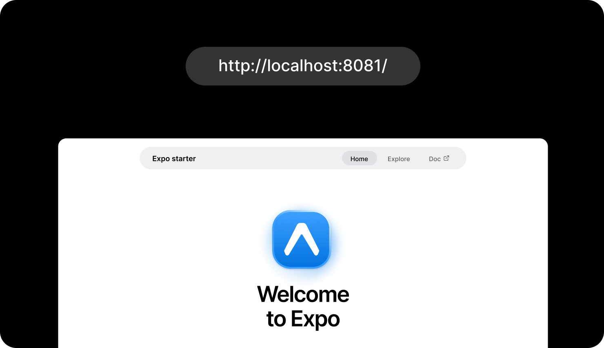
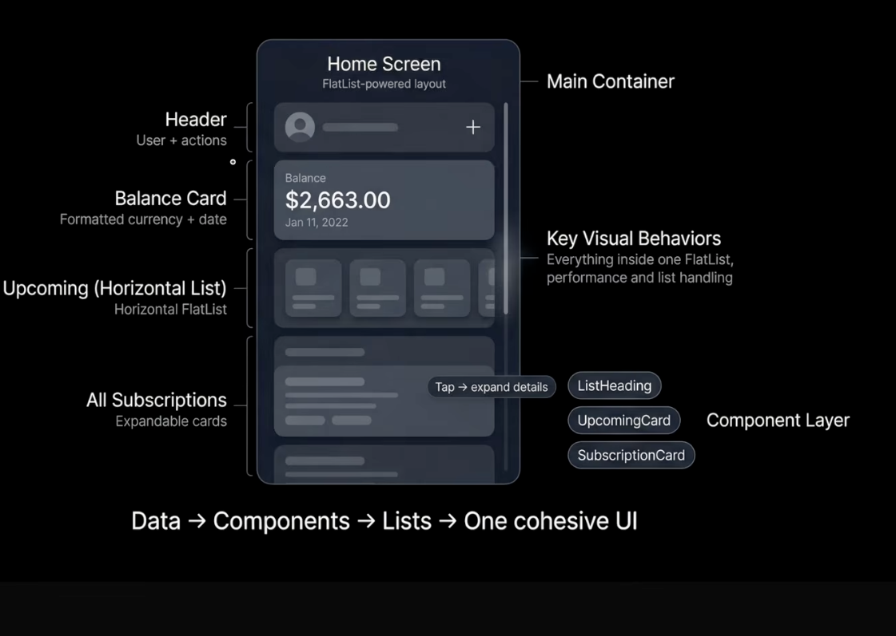

<div align="center">
  <br />
  
  <br />
  <br />

  <div>
    
    
    
    <br />
    
    
    
    <br />
    
    
    
    
  </div>

  <h3 align="center">Subscription Management | React Native App</h3>

  <div align="center">
    Built by <b>Eric</b>, a JavaScript developer, as a clean mobile experience for tracking subscriptions, renewals, and recurring spend.
  </div>
</div>

## 📋 <a name="table">Table of Contents</a>

1. ✨ [Introduction](#introduction)
2. 🧩 [App Structure](#app-structure)
3. ⚙️ [Tech Stack](#tech-stack)
4. 🔋 [Features](#features)
5. 🤸 [Quick Start](#quick-start)
6. 🔐 [Environment Variables](#environment-variables)
7. 📁 [Project Structure](#project-structure)

## <a name="introduction">✨ Introduction</a>

Recurrly is a subscription management app designed to help users see and control recurring expenses from one focused mobile dashboard. It brings together upcoming renewals, subscription status, billing metadata, and clean navigation so users can quickly understand where their money is going.

This repository contains the React Native and Expo app layer. It currently includes Expo Router navigation, NativeWind styling, local subscription data, authentication screens, analytics dependencies, custom tab navigation, typed app constants, and image/icon assets for a polished subscription tracking interface.

## <a name="app-structure">🧩 App Structure</a>

The home screen is organized as one cohesive list-powered experience: user actions, balance, upcoming renewals, and subscription cards all live in a single flow.

<div align="center">
  
</div>

## <a name="tech-stack">⚙️ Tech Stack</a>

### Frontend & Mobile

* **[React Native](https://reactnative.dev/)** powers the native mobile UI from a shared React codebase.
* **[Expo](https://expo.dev/)** provides the development runtime, Metro server, asset handling, native tooling, and device preview workflow.
* **[Expo Router](https://docs.expo.dev/router/introduction/)** adds file-based routing for auth screens, tabs, onboarding, and subscription detail pages.
* **[TypeScript](https://www.typescriptlang.org/)** keeps app data, navigation values, and shared constants easier to maintain.
* **[NativeWind](https://www.nativewind.dev/)** brings utility-first styling to React Native for fast, consistent UI development.

### Auth, Analytics & Tooling

* **[Clerk](https://clerk.com/)** is included for secure sign-in, sign-up, and session management workflows.
* **[PostHog](https://posthog.com/)** is included for product analytics and usage insights once app events are wired in.
* **[CodeRabbit](https://www.coderabbit.ai/)** can be used for AI-assisted pull request review and code quality feedback.

### Backend-Ready Path

* **[Node.js](https://nodejs.org/)**, **[Express](https://expressjs.com/)**, and **[MongoDB](https://www.mongodb.com/)** are a natural backend path for turning the current local subscription data into persistent user-owned records.
* The current repo is mobile-focused; backend implementation can be added as a separate service or connected API layer.

## <a name="features">🔋 Features</a>

👉 **Subscription Dashboard**: A central home screen for monitoring balance, upcoming renewals, and recurring services.

👉 **Upcoming Renewals**: Horizontal previews show which subscriptions are coming due soon.

👉 **Active, Paused & Cancelled States**: Subscription records include status metadata so the UI can distinguish what is still charging and what is no longer active.

👉 **Dynamic Detail Routes**: Each subscription can resolve to a detail route through `app/subscriptions/[id].tsx`.

👉 **Secure Auth Foundation**: Clerk dependencies and auth routes are already in place for sign in, sign up, and protected user flows.

👉 **Native Tab Navigation**: Home, Subscriptions, Insights, and Settings are organized with a custom icon-based tab bar.

👉 **Reusable Theme Tokens**: Shared colors, spacing, and component sizing live in `constants/theme.ts`.

👉 **Analytics Ready**: PostHog is available for tracking feature usage, onboarding behavior, and subscription management actions.

👉 **Real App Assets**: The project includes service icons, app icons, splash assets, custom fonts, and visual documentation for the home layout.

## <a name="quick-start">🤸 Quick Start</a>

Follow these steps to run the project locally.

**Prerequisites**

- [Git](https://git-scm.com/)
- [Node.js](https://nodejs.org/en) `>=20.19.4`
- [npm](https://www.npmjs.com/)
- [Expo Go](https://expo.dev/go) for physical-device testing

**Cloning the Repository**

```bash
git clone https://github.com/Ericokim/react_native_recurrly.git
cd react_native_recurrly
```

**Installation**

```bash
npm install
```

**Running the Project**

```bash
npm run start
```

Expo starts Metro Bundler and prints a QR code in your terminal. Scan it with Expo Go, or use the terminal shortcuts:

- `a` opens Android
- `i` opens iOS Simulator on macOS
- `w` opens the web preview
- `r` reloads the app
- `m` opens the dev menu

## <a name="environment-variables">🔐 Environment Variables</a>

Create a `.env` file in the root of the project when connecting real auth and analytics services.

```env
EXPO_PUBLIC_CLERK_PUBLISHABLE_KEY=
POSTHOG_PROJECT_TOKEN=
POSTHOG_HOST=https://us.i.posthog.com
```

Only expose client-safe values through `EXPO_PUBLIC_*`. Keep server secrets out of the mobile app bundle.

## <a name="project-structure">📁 Project Structure</a>

```text
app/
  (auth)/              Sign-in and sign-up routes
  (tabs)/              Main tab navigation screens
  subscriptions/[id]   Dynamic subscription detail route
  _layout.tsx          Root Expo Router layout
  onboarding.tsx       Onboarding screen
assets/
  fonts/               Plus Jakarta Sans font files
  icons/               App and subscription icons
  images/              App images and README visuals
constants/
  data.ts              Tabs, user, balance, and subscription data
  icons.ts             Icon exports
  images.ts            Image exports
  theme.ts             Colors, spacing, and component tokens
lib/
  utils.ts             Shared utilities
```

## 🚀 Developer

Recurrly is built and maintained by **Eric** as a practical React Native project focused on clean product structure, reusable mobile UI patterns, and a subscription experience that can grow into a full-stack app.
